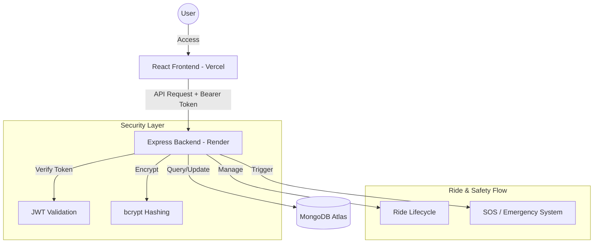

# Rider App - Premium Urban Mobility Platform

A high-fidelity, production-grade ride-hailing application featuring a comprehensive **Rider**, **Driver**, and **Admin** experience. Built with a modern tech stack and designed with a premium, glassmorphism-inspired UI.

## 🚀 Live Public Pages
Explore the premium public-facing pages:
- **Home**: [https://rider-app-frontend-one.vercel.app/](https://rider-app-frontend-one.vercel.app/) - Immersive landing page.
- **Features**: [https://rider-app-frontend-one.vercel.app/features](https://rider-app-frontend-one.vercel.app/features) - Role-specific feature breakdowns.
- **About Us**: [https://rider-app-frontend-one.vercel.app/about](https://rider-app-frontend-one.vercel.app/about) - Mission, team, and stats.
- **Contact**: [https://rider-app-frontend-one.vercel.app/contact](https://rider-app-frontend-one.vercel.app/contact) - 24/7 Support form.
- **FAQ**: [https://rider-app-frontend-one.vercel.app/faq](https://rider-app-frontend-one.vercel.app/faq) - Common questions and search.

## 🔐 Authentication
- **Login**: [https://rider-app-frontend-one.vercel.app/login](https://rider-app-frontend-one.vercel.app/login)
- **Register**: [https://rider-app-frontend-one.vercel.app/register](https://rider-app-frontend-one.vercel.app/register)

## 📊 Feature-Rich Dashboards
Access role-protected dashboards (Login required):

### 1. Rider Dashboard (`/dashboard/rider`)
- **Book a Ride**: Intuitive destination search and vehicle selection.
- **Active Ride**: Real-time tracking and floating **SOS Button** for safety.
- **History**: View past trips and receipts.

### 2. Driver Dashboard (`/dashboard/driver`)
- **Earnings**: Real-time charts visualizing weekly/monthly income.
- **Status Toggle**: Go Online/Offline instantly.
- **Requests**: Accept or reject incoming ride requests in real-time.

### 3. Admin Dashboard (`/dashboard/admin`)
- **Analytics**: System-wide revenue, user growth, and ride volume.
- **User Management**: Monitor and block/unblock users.
- **Live Map**: Real-time visualization of the entire fleet.

---

## 🛠️ Technology Stack

### Frontend (`/frontend`)
- **Framework**: React 18 + Vite (TypeScript)
- **State Management**: Redux Toolkit & RTK Query
- **Styling**: Tailwind CSS + Custom Design System (Glassmorphism)
- **Animations**: Framer Motion (Page transitions, scroll effects)
- **Maps**: Recharts (Analytics) & Custom Map Components

### Backend (`/backend`)
- **Runtime**: Node.js + Express
- **Language**: TypeScript
- **Database**: MongoDB (Mongoose)
- **Auth**: JWT (JSON Web Tokens) with secure HttpOnly cookies
- **Validation**: Zod (Strict schema validation)

---

## 📂 Folder Structure

```
.
├── backend                 # Node.js/Express service
│   ├── src
│   │   ├── controllers     # Request handlers
│   │   ├── middleware      # Auth & Error middlewares
│   │   ├── models          # Mongoose schemas
│   │   ├── routes          # API endpoints
│   │   └── utils           # Helper functions (JWT, etc.)
│   └── tsconfig.json       # TypeScript configuration
├── frontend                # React/Vite service
│   ├── src
│   │   ├── components      # UI Components (Glassmorphism)
│   │   ├── pages           # Router Views (Dashboards, Auth)
│   │   ├── store           # Global state (Redux, RTK Query)
│   │   └── index.css       # Global styles (Tailwind)
│   └── tailwind.config.js  # Design tokens & theme
└── README.md               # Master documentation
```

---

## 🏗️ Auth & System Architecture



---

## 🏁 Getting Started

### Prerequisites
- Node.js (v18+)
- MongoDB (Local or Atlas)

### Installation

1.  **Clone the repository**
2.  **Start the Backend**:
    ```bash
    cd backend
    npm install
    npm run dev
    # Server running on http://localhost:5000
    ```
3.  **Start the Frontend**:
    ```bash
    cd frontend
    npm install
    npm run dev
    # Client running on http://localhost:5173
    ```

## ✨ "Premium" Design Philosophy
This project adheres to a "Best All Over" quality standard:
- **Zero Console Errors**: Strict typing and linting checks passed.
- **Glassmorphism**: Consistent use of backdrop blur, translucent layers, and subtle borders.
- **Motion**: Smooth entrance animations (Framer Motion) on every page.
- **Accessibility**: Semantic HTML and keyboard navigation support.

---

**Developed with ❤️ and Code**
