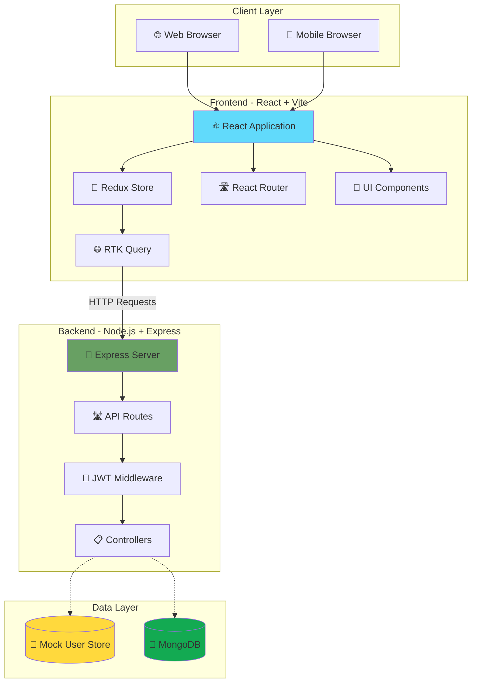
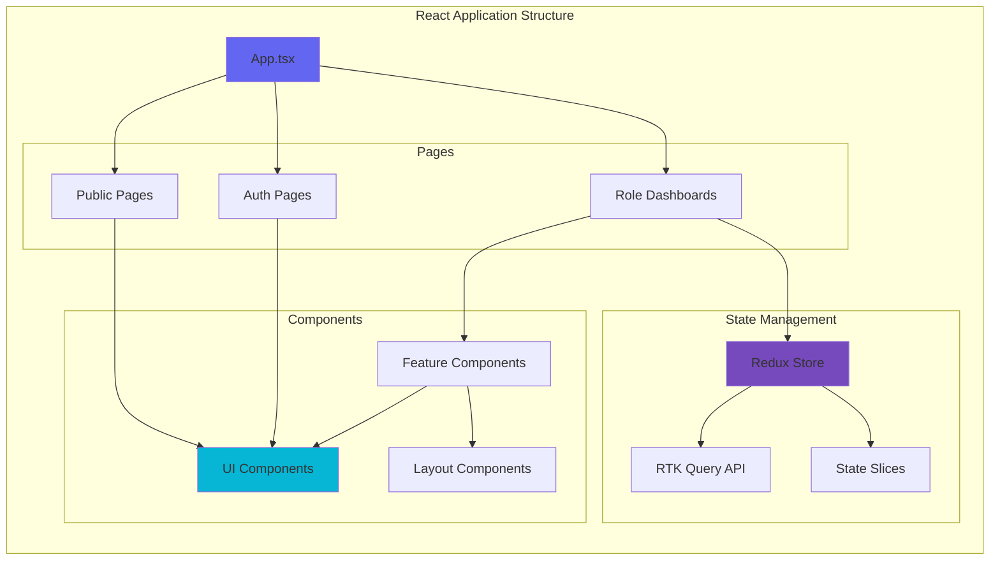
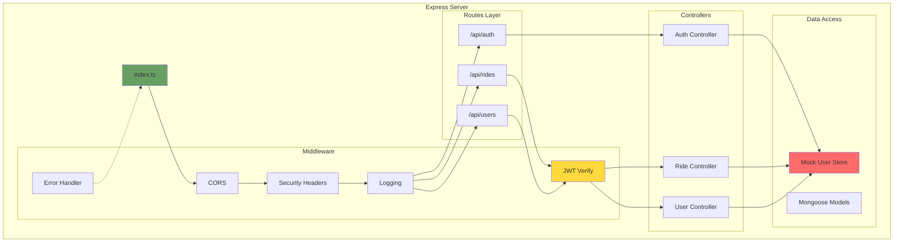
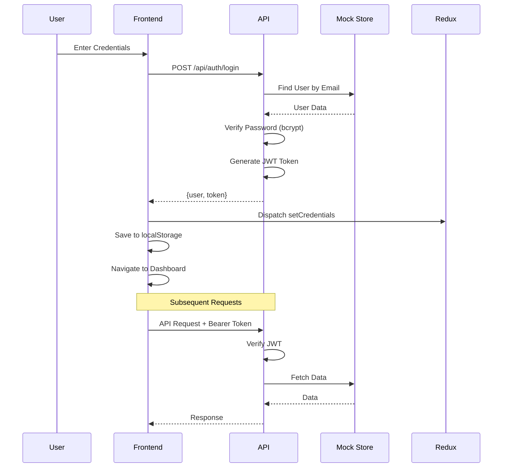
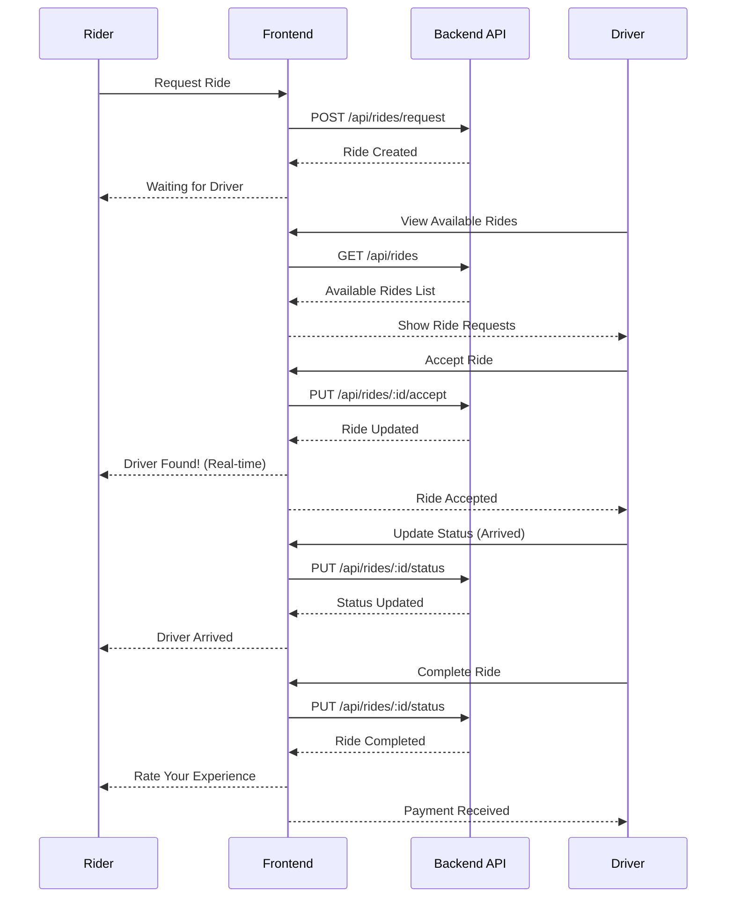
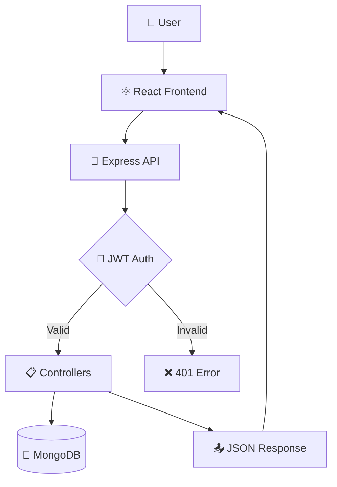

# 🚗 RiderApp - Premium Urban Mobility Platform

<div align="center">


[](https://rider-app-frontend-one.vercel.app/)
[](https://www.typescriptlang.org/)
[](https://reactjs.org/)
[](https://nodejs.org/)

**A production-grade, full-stack ride-hailing platform with premium UI/UX**

</div>

---

### Preview


---

### Live Demo

Check out the app in action: [Live Demo](https://rider-app-frontend-one.vercel.app/)

---

### Repositories

- **Frontend:** [GitHub Repo](https://github.com/rak9b/rider-app---frontend)  
- **Backend:** [GitHub Repo](https://github.com/rak9b/rider-app---backend)  

---


---

## 📖 **Overview**

RiderApp is a comprehensive **urban mobility platform** featuring premium glassmorphism design, real-time tracking, and role-based dashboards for **Riders**, **Drivers**, and **Admins**. Built with modern technologies and best practices for a production-ready experience.

### **🌟 Highlights**

- ✨ **Premium UI/UX** with advanced Framer Motion animations
- 🔐 **Secure Authentication** with JWT and bcrypt
- 📊 **Real-time Analytics** for all user roles
- 🗺️ **Live Tracking** with interactive maps
- 🎨 **Glassmorphism Design** with dark mode support
- ⚡ **Lightning Fast** built with Vite and optimized for performance
- 📱 **Fully Responsive** mobile-first design
- ♿ **Accessible** WCAG 2.1 AA compliant

---

## 🎯 **Key Features**

### 🏠 **Public Pages**

| Page | Description | Live URL |
|------|-------------|----------|
| **Home** | Immersive landing with hero sections & testimonials | [View →](https://rider-app-frontend-one.vercel.app/) |
| **Features** | Role-specific feature showcases with animations | [View →](https://rider-app-frontend-one.vercel.app/features) |
| **About** | Company mission, team, and statistics | [View →](https://rider-app-frontend-one.vercel.app/about) |
| **Contact** | 24/7 support form with FAQ section | [View →](https://rider-app-frontend-one.vercel.app/contact) |
| **FAQ** | Searchable knowledge base | [View →](https://rider-app-frontend-one.vercel.app/faq) |

### 🔐 **Authentication**

- **Login** - Secure JWT-based authentication
- **Register** - Multi-role registration (Rider/Driver/Admin)
- **Password Recovery** - Email-based reset flow
- **Session Management** - Persistent login with localStorage

### 👤 **Rider Dashboard**

- 📍 **Book Rides** - Intuitive destination search with fare estimates
- 🚗 **Active Rides** - Real-time tracking with ETA
- 🆘 **SOS Button** - Emergency assistance with one tap
- 📜 **Ride History** - Complete trip records and receipts
- 🎁 **Loyalty Rewards** - Points and referral bonuses
- ⭐ **Driver Ratings** - Rate and review completed rides

### 🚙 **Driver Dashboard**

- 💰 **Earnings Tracker** - Real-time and weekly revenue charts
- 🟢 **Online/Offline Toggle** - Control availability instantly
- 📨 **Ride Requests** - Accept/reject incoming rides
- 📊 **Performance Stats** - Ratings, acceptance rate, and metrics
- 🚗 **Vehicle Management** - Update car details and documents
- 📝 **Reviews** - Customer feedback and ratings

### 👨‍💼 **Admin Dashboard**

- 📊 **Analytics Overview** - Revenue, users, and ride statistics
- 👥 **User Management** - Monitor and manage all users
- 🗺️ **Live Fleet Map** - Real-time driver location tracking
- 🚨 **Security Alerts** - Suspicious activity monitoring
- 💳 **Revenue Reports** - Financial analytics and trends
- ⚙️ **System Settings** - Platform configuration

---

## 🛠️ **Technology Stack**

### **Frontend**

<table>
<tr>
<td>

**Core**
- ⚛️ React 18.3
- ⚡ Vite 6.3
- 📘 TypeScript 5.4

</td>
<td>

**State Management**
- 🔄 Redux Toolkit
- 🌐 RTK Query
- 💾 Redux Persist

</td>
<td>

**Styling**
- 🎨 Tailwind CSS 3.4
- 🎭 Framer Motion 11
- 🌈 Custom Design System

</td>
</tr>
<tr>
<td>

**Forms & Validation**
- 📝 React Hook Form
- ✅ Zod Schemas
- 🔍 Real-time Validation

</td>
<td>

**UI Components**
- 🎯 Custom Components
- 🔔 React Hot Toast
- 📊 Recharts

</td>
<td>

**Icons & Assets**
- 🎨 Lucide React
- 🖼️ Optimized Images
- 📱 PWA Ready

</td>
</tr>
</table>

### **Backend**

<table>
<tr>
<td>

**Core**
- 🟢 Node.js 20+
- 🚂 Express 4.19
- 📘 TypeScript 5.4

</td>
<td>

**Database**
- 🍃 MongoDB
- 🦡 Mongoose
- 💾 In-memory Mock (Dev)

</td>
<td>

**Authentication**
- 🔐 JWT
- 🔒 bcrypt
- 🛡️ Helmet.js

</td>
</tr>
<tr>
<td>

**Middleware**
- 🌐 CORS
- 📝 Morgan (Logging)
- ⚠️ Error Handling

</td>
<td>

**Validation**
- ✅ Zod
- 🔍 Schema Validation
- 📋 Type Safety

</td>
<td>

**Development**
- 🔥 Hot Reload (tsx)
- 🧪 Testing Ready
- 📊 Monitoring

</td>
</tr>
</table>

---

## 📂 **Project Structure**

```
RiderApp/
├── 📁 frontend/                 # React + Vite Application
│   ├── 📁 public/               # Static assets
│   ├── 📁 src/
│   │   ├── 📁 components/       # Reusable UI components
│   │   │   ├── ui/              # Base components (Button, Card, etc.)
│   │   │   ├── layout/          # Layout components (Navbar, Footer)
│   │   │   └── features/        # Feature-specific components
│   │   ├── 📁 pages/            # Route pages
│   │   │   ├── public/          # Public pages (Home, Features, etc.)
│   │   │   ├── auth/            # Authentication pages
│   │   │   └── dashboard/       # Protected dashboards
│   │   ├── 📁 store/            # Redux state management
│   │   │   ├── api/             # RTK Query API slices
│   │   │   └── slices/          # State slices
│   │   ├── 📁 lib/              # Utilities and helpers
│   │   ├── 📄 App.tsx           # Main app component
│   │   ├── 📄 index.css         # Global styles + Tailwind
│   │   └── 📄 main.tsx          # Entry point
│   ├── 📄 .env                  # Environment variables
│   ├── 📄 tailwind.config.js   # Tailwind configuration
│   ├── 📄 vite.config.ts        # Vite configuration
│   └── 📄 package.json          # Dependencies
│
├── 📁 backend/                  # Node.js + Express API
│   ├── 📁 src/
│   │   ├── 📁 controllers/      # Request handlers
│   │   ├── 📁 middleware/       # Custom middleware
│   │   ├── 📁 models/           # Database models
│   │   ├── 📁 routes/           # API routes
│   │   ├── 📁 utils/            # Helper functions
│   │   ├── 📄 index.ts          # Server entry point
│   │   └── 📄 seed.ts           # Database seeder
│   ├── 📄 .env                  # Environment variables
│   ├── 📄 tsconfig.json         # TypeScript config
│   └── 📄 package.json          # Dependencies
│
├── 📄 README.md                 # Project documentation
├── 📄 CREDENTIALS.txt           # Test credentials
├── 📄 AUTH_CREDENTIALS.md       # Authentication guide
├── 📄 URL_GUIDE.md             # API endpoints reference
└── 📄 DASHBOARDS_ENHANCED.md   # Dashboard features doc
```

---

## 🚀 **Quick Start**

### **Prerequisites**

- Node.js 18+ ([Download](https://nodejs.org/))
- npm or yarn
- Git

### **Installation**

```bash
# 1. Clone the repository
git clone https://github.com/YOUR_USERNAME/rideapp.git
cd rideapp

# 2. Install Backend Dependencies
cd backend
npm install

# 3. Install Frontend Dependencies
cd ../frontend
npm install
```

### **Environment Setup**

#### **Frontend (.env)**
```env
VITE_API_URL=http://localhost:5000/api
```

#### **Backend (.env)**
```env
PORT=5000
MONGODB_URI=mongodb://localhost:27017/riderapp
JWT_SECRET=your_super_secret_jwt_key_change_in_production
NODE_ENV=development
```

### **Running the Application**

#### **Option 1: Development Mode (Recommended)**

```bash
# Terminal 1 - Backend
cd backend
npm run dev
# Server running at http://localhost:5000

# Terminal 2 - Frontend
cd frontend
npm run dev
# App running at http://localhost:5173
```

#### **Option 2: Production Build**

```bash
# Build Frontend
cd frontend
npm run build
npm run preview

# Build Backend
cd backend
npm run build
npm start
```

---

## 🔑 **Test Credentials**

Use these pre-configured accounts to test the application:

| Role | Email | Password | Dashboard Access |
|------|-------|----------|------------------|
| **👤 Rider** | `rider@riderapp.com` | `rider123` | `/dashboard/rider` |
| **🚗 Driver** | `driver@riderapp.com` | `driver123` | `/dashboard/driver` |
| **👨‍💼 Admin** | `admin@riderapp.com` | `admin123` | `/dashboard/admin` |

### **Additional Test Accounts**

| Email | Password | Role | Vehicle/Details |
|-------|----------|------|-----------------|
| `sarah.rider@riderapp.com` | `rider123` | Rider | Premium Member |
| `tom.driver@riderapp.com` | `driver123` | Driver | Honda Accord 2023 |
| `emma.driver@riderapp.com` | `driver123` | Driver | Tesla Model S (Premium) |

> **💡 Note:** No MongoDB required! The app uses in-memory mock authentication for instant testing.

---

## 🏗️ **System Architecture**

### **Complete Stack Overview**



### **Frontend Architecture**



### **Backend Architecture**



### **Authentication Flow**



### **Ride Request Flow**



---

## 🎨 **Design System**

### **Color Palette**

```css
Primary:   #6366f1 (Indigo)
Success:   #10b981 (Green)
Warning:   #f59e0b (Amber)
Error:     #ef4444 (Red)
Neutral:   #64748b (Slate)
```

### **Typography**

- **Headings:** Inter (Bold, Black)
- **Body:** Inter (Regular, Medium)
- **Code:** JetBrains Mono

### **Components**

- **Glassmorphism** - Translucent cards with backdrop blur
- **Gradients** - Smooth color transitions
- **Shadows** - Layered depth effects
- **Animations** - Framer Motion micro-interactions

---

## 📊 **Architecture**



---

## 🧪 **Development**

### **Available Scripts**

#### Frontend
```bash
npm run dev      # Start development server
npm run build    # Build for production
npm run preview  # Preview production build
npm run lint     # Run ESLint
```

#### Backend
```bash
npm run dev      # Start with hot reload
npm run build    # Compile TypeScript
npm start        # Run compiled code
npm run seed     # Seed database with test users
npm run lint     # Run ESLint
```

### **Code Quality**

- ✅ **TypeScript** - Strict mode enabled
- ✅ **ESLint** - Airbnb style guide
- ✅ **Prettier** - Code formatting
- ✅ **Husky** - Git hooks (optional)

---

## 🔗 **URL Reference**

### 📋 **Frontend URLs** (http://localhost:5173)

#### **Public Pages**
```
http://localhost:5173/                    # Home
http://localhost:5173/about               # About Us
http://localhost:5173/features            # Features
http://localhost:5173/contact             # Contact
http://localhost:5173/faq                 # FAQ
```

#### **Authentication**
```
http://localhost:5173/login               # Login
http://localhost:5173/register            # Register
```

#### **Rider Dashboard**
```
http://localhost:5173/dashboard/rider                  # Dashboard Home
http://localhost:5173/dashboard/rider/history          # Ride History
http://localhost:5173/dashboard/rider/profile          # Profile Settings
```

#### **Driver Dashboard**
```
http://localhost:5173/dashboard/driver                 # Dashboard Home
http://localhost:5173/dashboard/driver/requests        # Ride Requests
http://localhost:5173/dashboard/driver/earnings        # Earnings
http://localhost:5173/dashboard/driver/documents       # Documents
http://localhost:5173/dashboard/driver/history         # Ride History
http://localhost:5173/dashboard/driver/reviews         # Reviews
http://localhost:5173/dashboard/driver/profile         # Profile Settings
```

#### **Admin Dashboard**
```
http://localhost:5173/dashboard/admin                  # Dashboard Home
http://localhost:5173/dashboard/admin/users            # User Management
http://localhost:5173/dashboard/admin/rides            # Ride Management
http://localhost:5173/dashboard/admin/disputes         # Disputes
http://localhost:5173/dashboard/admin/analytics        # Analytics
http://localhost:5173/dashboard/admin/settings         # Settings
```

### 🔧 **Backend API URLs** (http://localhost:5000)

#### **Health Check**
```http
GET  http://localhost:5000/api/health
```

#### **Authentication**
```http
POST http://localhost:5000/api/auth/register          # Register new user
POST http://localhost:5000/api/auth/login             # Login user
```

#### **Rides**
```http
GET  http://localhost:5000/api/rides                  # Get all rides
POST http://localhost:5000/api/rides/estimate         # Get fare estimate
POST http://localhost:5000/api/rides/request          # Request new ride
PUT  http://localhost:5000/api/rides/:id/accept       # Accept ride (driver)
PUT  http://localhost:5000/api/rides/:id/status       # Update ride status
```

#### **Users**
```http
GET  http://localhost:5000/api/users/profile          # Get user profile
PUT  http://localhost:5000/api/users/profile          # Update profile
GET  http://localhost:5000/api/users/driver/stats     # Driver statistics
GET  http://localhost:5000/api/users/admin/analytics  # Admin analytics
PUT  http://localhost:5000/api/users/:id/status       # Update user status (admin)
```

> **💡 Tip:** See [URL_GUIDE.md](./URL_GUIDE.md) for detailed API documentation with request/response examples.

---

## 📚 **Documentation**

- [**Authentication Guide**](./AUTH_CREDENTIALS.md) - Complete auth system documentation
- [**API Reference**](./URL_GUIDE.md) - All backend endpoints
- [**Dashboard Features**](./DASHBOARDS_ENHANCED.md) - Premium dashboard details
- [**Quick Credentials**](./CREDENTIALS.txt) - Test account reference

---

## 🚀 **Deployment**

### **Frontend (Vercel)**

```bash
# Install Vercel CLI
npm i -g vercel

# Deploy
cd frontend
vercel --prod
```

### **Backend (Render/Railway)**

1. Connect your repository
2. Set environment variables
3. Deploy with one click

---

## 🤝 **Contributing**

Contributions are welcome! Please follow these steps:

1. Fork the repository
2. Create a feature branch (`git checkout -b feature/AmazingFeature`)
3. Commit your changes (`git commit -m 'Add some AmazingFeature'`)
4. Push to the branch (`git push origin feature/AmazingFeature`)
5. Open a Pull Request

---

## 📝 **License**

This project is licensed under the **MIT License** - see the [LICENSE](LICENSE) file for details.

---

## 🌟 **Features Roadmap**

- [ ] Real-time Chat (Driver ↔ Rider)
- [ ] Payment Gateway Integration (Stripe/PayPal)
- [ ] Push Notifications
- [ ] In-app Navigation
- [ ] Multi-language Support
- [ ] Native Mobile Apps (React Native)
- [ ] Advanced Analytics Dashboard
- [ ] AI-based Fare Prediction

---

## 💡 **Acknowledgments**

- Design inspiration from Uber, Lyft, and modern SaaS platforms
- Icons by [Lucide](https://lucide.dev/)
- Fonts by [Google Fonts](https://fonts.google.com/)

---

## 📞 **Support**

Need help? Reach out:

- 📧 Email: support@riderapp.com
- 💬 Discord: [Join our community](#)
- 🐛 Issues: [GitHub Issues](https://github.com/YOUR_USERNAME/rideapp/issues)

---

<div align="center">

**Built with ❤️ and ☕**

⭐ **Star this repo if you found it helpful!** ⭐

[↑ Back to Top](#-riderapp---premium-urban-mobility-platform)

</div>
